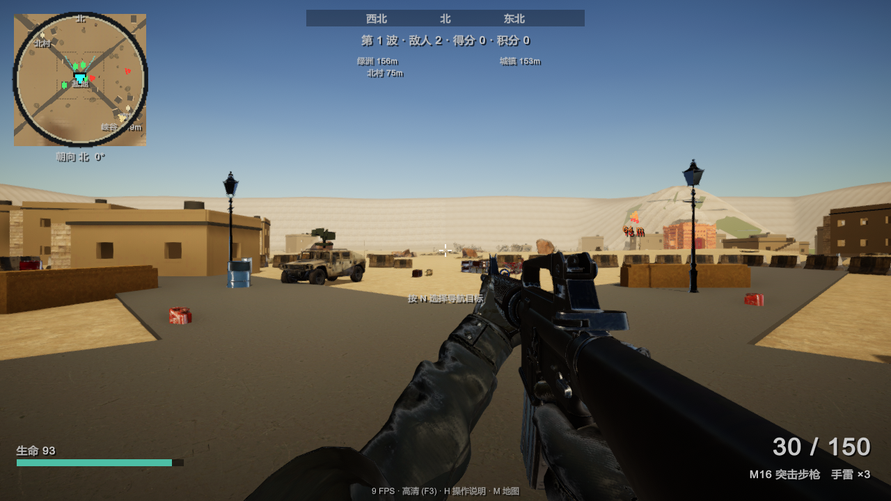
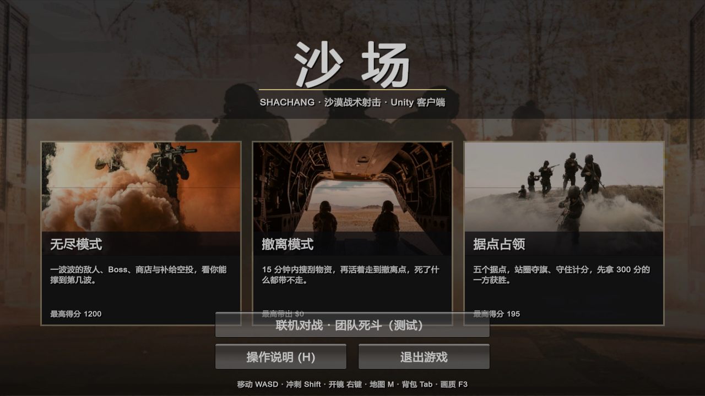
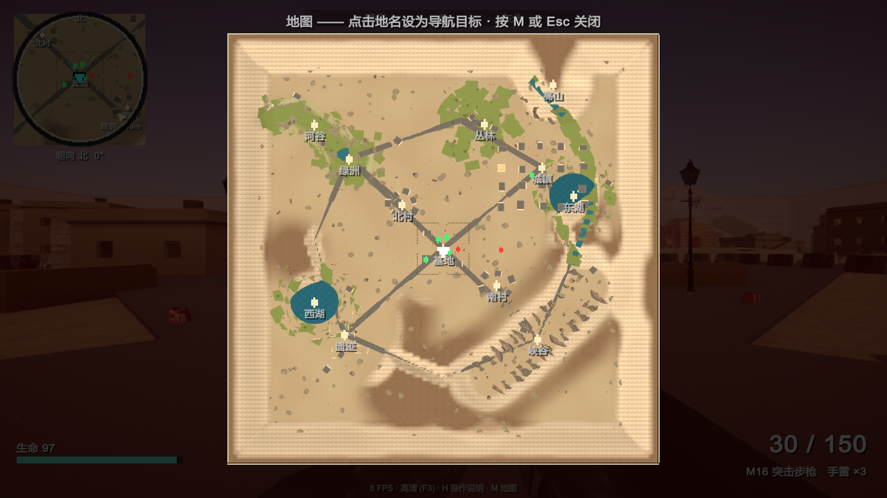
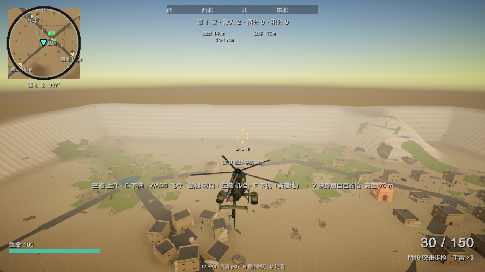
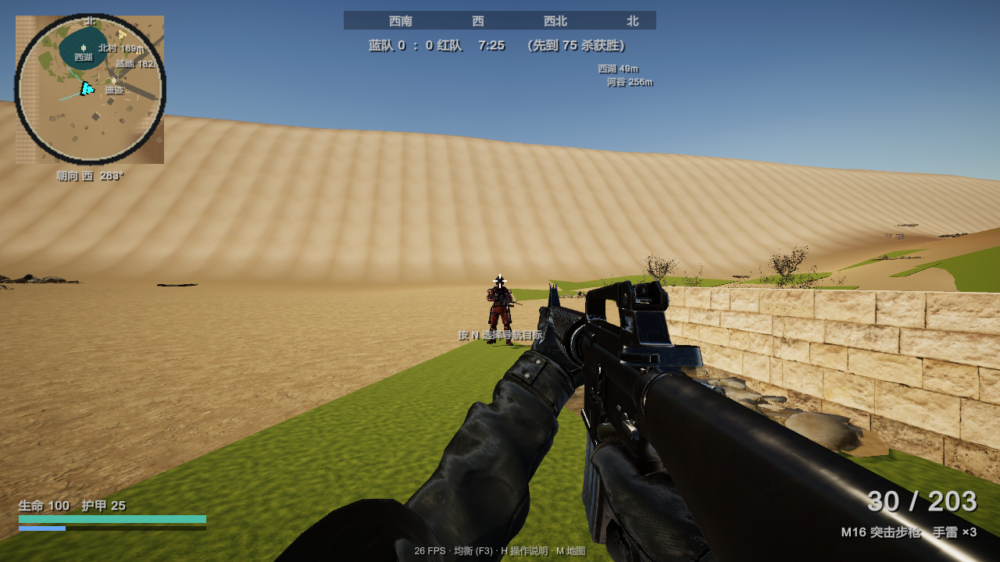

# ShaChang 

A first-person shooter built in Unity for Windows PC: a procedurally generated desert battlefield with
six zones, drivable vehicles, a helicopter, destructible cover, weather and a day/night cycle, plus a
6v6 online team deathmatch running on a dedicated Linux server.

The whole world — terrain, roads, rivers, towns, props, loot and spawns — is generated from a single
seed at startup, so every machine builds an identical map without shipping a scene full of hand-placed
objects. That is what makes the networked mode cheap: clients only exchange players, shots and vehicle
seats, never the world itself.

| | |
|---|---|
| **Engine** | Unity 6000.3.22f1, Built-in Render Pipeline, linear colour space |
| **Target** | Windows 64-bit player, Linux 64-bit dedicated server |
| **Networking** | FishNet 4.7.3 over the Tugboat UDP transport, server authoritative |
| **Language** | C#, no third-party gameplay frameworks |



| | |
|---|---|
|  |  |
|  |  |

---

## Game modes

| Mode | Description |
|---|---|
| **Endless** (无尽) | Waves of AI squads with a between-wave shop. Enemy tanks arrive from wave 4. |
| **Extraction** (撤离) | Loot the map for valuables and reach the extraction point alive. |
| **Conquest** (据点占领) | Capture and hold control points against AI squads. |
| **Online** (联机) | 6v6 team deathmatch on a dedicated server, joined from an in-game room list. |

## Controls

| Action | Key |
|---|---|
| Move / sprint / jump / crouch | `WASD` / `Shift` / `Space` / `C` (slide by crouching while sprinting) |
| Lean | `Q` / `E` |
| Fire / aim down sights / reload | Left mouse / right mouse / `R` |
| Weapons / grenade / melee | `1`–`5` or mouse wheel / `G` / `V` (a backstab is a one-hit kill) |
| Enter vehicle, pick up | `F` |
| Map, waypoint, backpack, torch | `M`, `N`, `Tab`, `L` |
| Shop (endless), help, quality, pause | `B`, `H`, `F3`, `Esc` |
| Helicopter | `Space` climb, `C` descend, `WASD` fly, mouse turn, left mouse door gun |

Five weapons — M16 assault rifle, M4 shotgun, Barrett sniper, SMG and RPG-7 — each with their own
recoil, spread and sight, and attachments (red dot, ACOG, silencer, grip, laser) on the rifle, SMG and
shotgun.

---

## Repository layout

```
Assets/
  Scripts/
    Core/          Game loop, HUD, modes, weather and day/night, tuning
    World/         Procedural terrain, roads, rivers, props, loot, capture points
    Characters/    First-person player controller, enemy AI
    Combat/        Weapon definitions, view models, attachments, projectiles
    Vehicles/      Jeep, armed pickup, motorbike, helicopter, AI tank
    Presentation/  Particle and audio helpers, generated textures
    Net/           FishNet boot, networked player, team deathmatch rules, vehicle sync, lobby client
  Editor/          Scene generator, player and dedicated-server build scripts, network tests
  Resources/       Models, materials, audio and UI loaded at runtime
  StreamingAssets/ tune.json - live tuning values, reloadable in game with F5
deploy/            Dedicated-server install scripts and the room directory service
docs/            Architecture, multiplayer design, deployment and testing notes
build.ps1        Runs any Editor build method headless and prints compiler errors
shot.ps1         Launches the built game, takes an automated screenshot and greps the log
```

There is no hand-authored scene to edit: `Editor/Builder.cs` generates `Assets/Scenes/Main.unity`
(lighting, materials, camera, networking objects) from code, so the scene can always be rebuilt from
scratch and never drifts from what the scripts expect.

## Building

```bash
# regenerate the scene, materials and networking assets
./build.ps1 -method Builder.Setup

# Windows player -> Build/ShaChang.exe
./build.ps1 -method Builder.Build

# Linux dedicated server -> ServerBuild/shachang-server.x86_64
./build.ps1 -method Builder.BuildLinuxServer
```

Each call opens Unity in batch mode, compiles, runs the method and prints any `error CS…` lines.

## Running a server

```bash
ShaChang.exe -server -port 8443 -batchmode -nographics          # match server
ShaChang.exe -connect <ip> -port 8443                           # client joins directly
```

For the real thing, `deploy/install.sh` sets up a Debian host with a `shachang@<port>`
systemd unit, a swap file and the firewall, and `install-lobby.sh` adds the small Python room
directory that the in-game server browser reads. See [docs/deployment.md](docs/deployment.md).

## Documentation

- [docs/architecture.md](docs/architecture.md) — how the game is put together and why
- [docs/multiplayer.md](docs/multiplayer.md) — the networked design, lag compensation and its pitfalls
- [docs/deployment.md](docs/deployment.md) — running the dedicated server and room directory
- [docs/testing.md](docs/testing.md) — the headless screenshot and network test harness

## Status

Single player is complete and playable. Online team deathmatch runs end to end — joining from the room
list, teams, spawns, server-side hit detection with lag compensation, scoring, respawns and vehicle
synchronisation — and is next in line for a wider playtest. Conquest and extraction are planned to
follow online, in that order.
